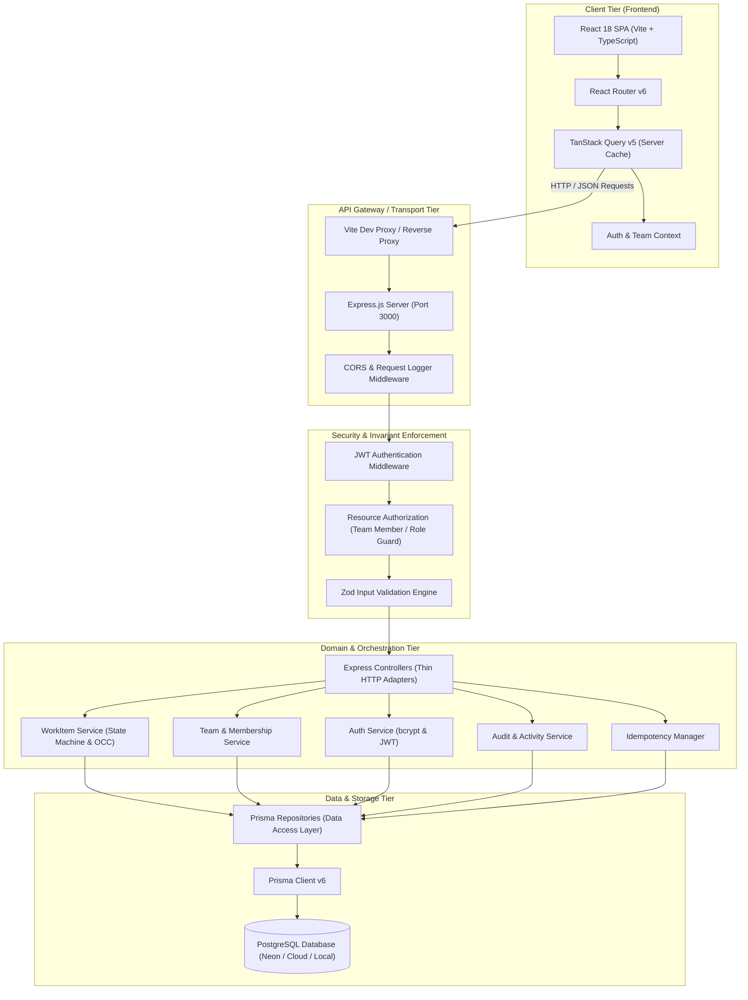
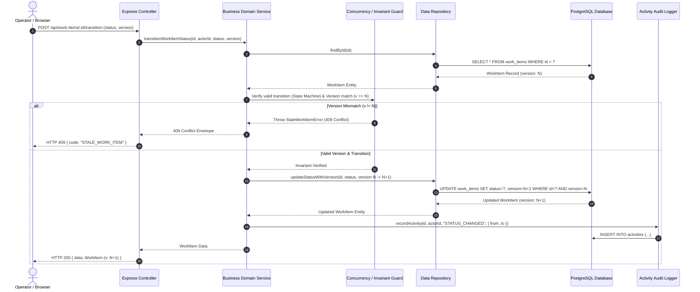
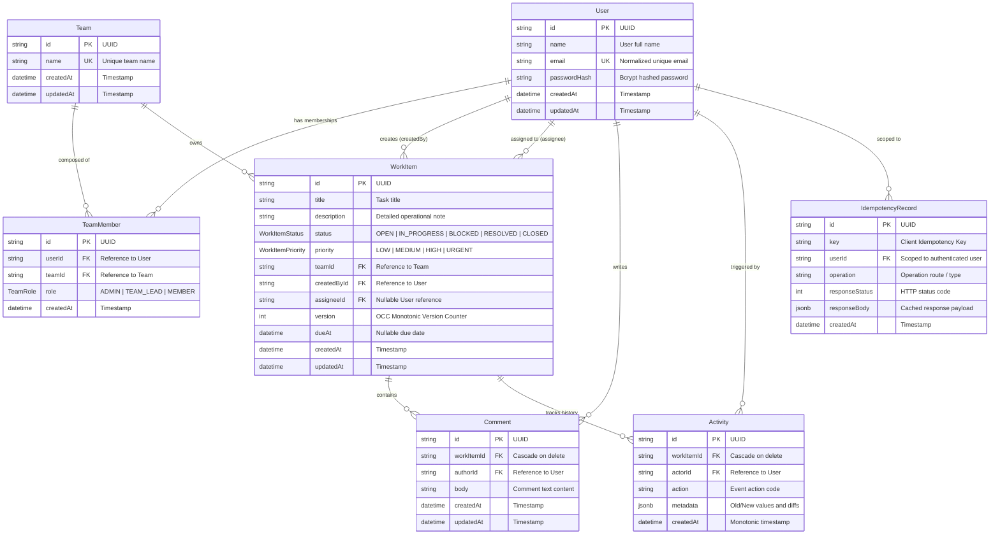
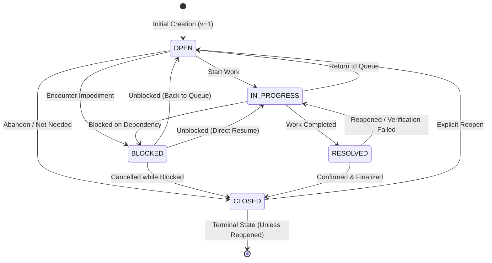
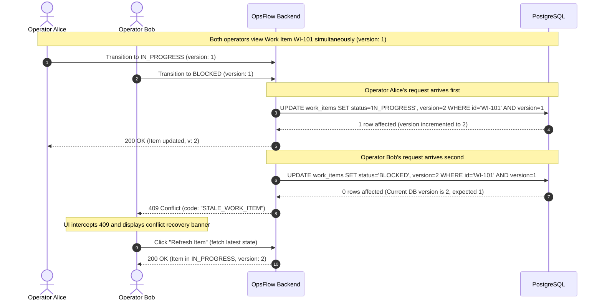
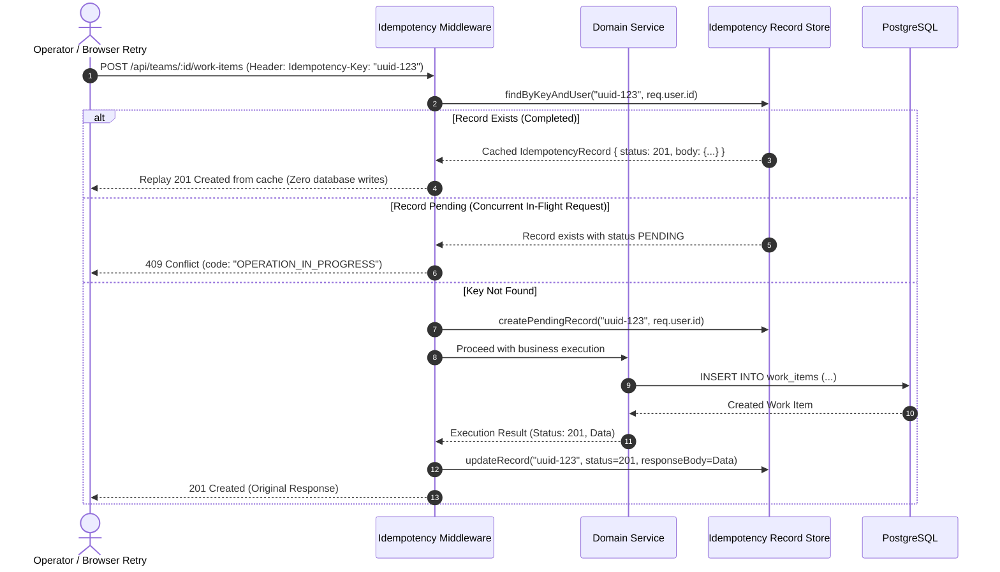

# OpsFlow — System Architecture & Design Specification

OpsFlow is an enterprise-grade operational work-management platform built to streamline incident resolution, team coordination, task tracking, and audit compliance under high operational pressure.

---

## 1. High-Level System Architecture

OpsFlow follows a clean, decoupled client-server architecture. The frontend communicates with the backend exclusively via RESTful JSON APIs, and the backend delegates persistence and transactions to a PostgreSQL database via Prisma ORM.



---

## 2. Layer Responsibilities & Data Flow

OpsFlow implements strict separation of concerns across dedicated architectural layers:



---

## 3. Relational Entity-Relationship Diagram

The database schema models users, multi-tenant teams, role assignments, operational work items, threaded comments, append-only audit activities, and deduplication records.



---

## 4. Work Item State Machine

The core operational state machine enforces strict lifecycle invariants. Arbitrary status jumps are rejected at the service layer with an `INVALID_STATUS_TRANSITION` error.



### State Machine Transition Invariants

| From Status | Allowed Target Statuses | Notes / Rationale |
| :--- | :--- | :--- |
| `OPEN` | `IN_PROGRESS`, `BLOCKED`, `CLOSED` | Cannot jump directly to `RESOLVED` without work being done. |
| `IN_PROGRESS` | `OPEN`, `BLOCKED`, `RESOLVED` | Work in progress can finish into `RESOLVED` or be paused. |
| `BLOCKED` | `OPEN`, `IN_PROGRESS`, `CLOSED` | Must be unblocked before it can be marked resolved. |
| `RESOLVED` | `IN_PROGRESS`, `CLOSED` | Can be closed or rejected back to active work. |
| `CLOSED` | `OPEN` | Can be revived back into the active queue. |

---

## 5. Optimistic Concurrency Control (OCC) Architecture

To prevent lost updates and race conditions under heavy operator load, Work Items maintain an integer `version` field starting at `1`.



---

## 6. Idempotency & Duplicate Operation Protection

Mutating requests (e.g. Work Item creation) accept an optional `Idempotency-Key` header. Requests are deduplicated per authenticated user:



---

## 7. Role-Based Access Control (RBAC) Matrix

Team access and operations are governed by three explicit roles:

| Action / Capability | `ADMIN` | `TEAM_LEAD` | `MEMBER` | Non-Member |
| :--- | :---: | :---: | :---: | :---: |
| View Team & Work Items | ✅ | ✅ | ✅ | ❌ (403) |
| Create Work Item | ✅ | ✅ | ✅ | ❌ (403) |
| Transition Work Item Status | ✅ | ✅ | ✅ | ❌ (403) |
| Add & Remove Comments | ✅ | ✅ | ✅ (Own) | ❌ (403) |
| Update Work Item Properties | ✅ | ✅ | ✅ | ❌ (403) |
| Delete Work Item | ✅ | ✅ | ❌ (403) | ❌ (403) |
| Invite / Add Members | ✅ | ✅ | ❌ (403) | ❌ (403) |
| Promote / Demote Member | ✅ | ❌ (403) | ❌ (403) | ❌ (403) |
| Remove Team Member | ✅ | ✅ (Members only) | ❌ (403) | ❌ (403) |
| Delete Team | ✅ | ❌ (403) | ❌ (403) | ❌ (403) |

---

## 8. Search, Filtering, and Pagination Pipeline

To scale reliably across tens of thousands of work items, all search and filtering queries execute directly at the PostgreSQL layer with indexed fields:

```
GET /api/teams/:teamId/work-items?search=...&status=...&priority=...&assigneeId=...&sortBy=createdAt&sortOrder=desc&page=1&limit=20
```

1. **Validation**: Zod schema validates bounds (`page >= 1`, `1 <= limit <= 100`, sanitized enum values).
2. **Query Building**:
   - `teamId`: Strictly scoped (multi-tenant boundary).
   - `search`: Case-insensitive `ILIKE` pattern across `title` and `description`.
   - `status`, `priority`, `assigneeId`: Exact match filters.
3. **Execution**:
   - Parallel `findMany` (with `skip = (page-1)*limit` and `take = limit`) and `count` queries.
4. **Envelope**:
   - Returns paginated data array along with `{ page, limit, total, totalPages }` pagination metadata.
